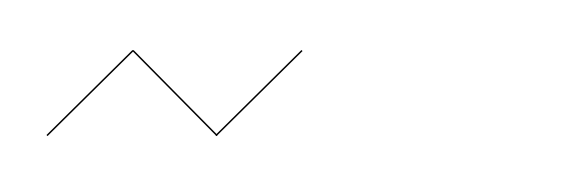

In this step we are going to move the turtle all around the field.

```
Forward {steps}
Backward {steps}
```

These commands are telling the turtle to move forward or backward specified number of steps.
Very important subject is a direction of movement. The turtle moves forward in the direction of its head. If we want to charge the direction then we need to turn the turtle with one of these commands:

```
Right {degrees}
Left {degrees}
```

You can imagine the turtle moves like a toy car without steering wheel. It can move forward and backward and in order to change its direction we need to do it by hands – lift the car up, turn it and then put it down.
So, the turning commands are working the same way as the moving commands – you need to specify number of degrees in which you want the turtle to turn left or right. And the degrees is the standard measure of angles.


Now you can try these new instructions, please make the turtle to draw a zig-zag pattern like this:



<!--solution-->

```
right 45
forward 50
right 90
forward 50
left 90
forward 50
```
