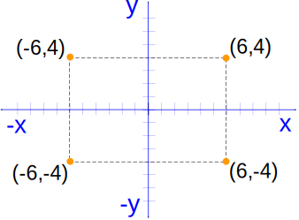

At this point we have learned how to command the LOGO's turtle to move with such functions as `forward`, `backward`, `right` and `left`. The common similarity is that they move the turtle relatively to its current position.

But there exists another possibility to exactly specify the point in which you want your turtle to go.

The LOGO's screen could be described with coordinates concept. Each point on the screen has horizontal (X-axis) and vertical (Y-axis) shift relative from the screen center.

By specifying the X and Y shift (coordinate) it is possible to exactly define any location on the screen. The point in the center of the screen has coordinates `x=0, y=0`. The point in the right top corner shown in the picture below has coordinates `x=6, y=4`.



The command `setxy <X> <Y>` will move the turtle to specified coordinates.

Example:

<!--logo {"width":"300px", "height":"200px", "code": true}-->

```
right 90
label "0,0
setcolor 4
setxy 60 40
label "60,40
setcolor 1
setxy 60 -40
label "60,-40
```

As you can see from the example the turtle will also draw a line from it's current position to a new position if it is in drawing mode. As it starts from the center it draws a red line to the point (60,40). Then it draws a blue line to the point (60,-40).

If you don't want to draw a line when the turtle moves you can lift the pen up with `penup` command.

Please use the `setxy` commands to draw a post envelope like this:

<!--logo {"width":"300px", "height":"200px", "solution": true}-->

```
setxy 60 40
setxy 60 -40
setxy -60 -40
setxy -60 40
setxy 60 40
setxy 0 0
setxy -60 40
```
